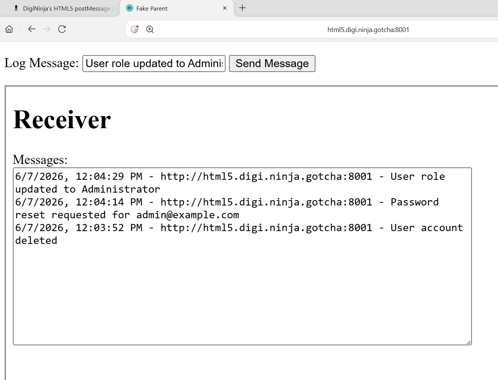

# DigiNinja HTML5 postMessage Lab 3 - Log Injection

## Summary

This lab demonstrates how weak validation of `event.origin` can allow an attacker to inject arbitrary messages into a trusted logging system.

The child iframe receives messages using `postMessage()` and attempts to verify the sender's origin before adding messages to a log. The validation uses a pattern match instead of an exact comparison, allowing attacker-controlled origins to bypass the check.

## Vulnerable Code

The receiver validates the sender using:

```javascript
let just_domain = CLIENT_DOMAIN.replace(regex, '');

if (!e.origin.match(just_domain)) {
    alert("Message came in from wrong origin");
    return;
}
```

The trusted origin is defined as:

```javascript
const CLIENT_DOMAIN = 'https://html5.digi.ninja';
```

## Vulnerability

The application trusts origins that match the trusted domain string rather than performing an exact comparison.

A secure implementation would use:

```javascript
if (e.origin !== CLIENT_DOMAIN) {
    return;
}
```

## Attack Overview

A malicious parent page was created which loaded the legitimate child iframe.

The attacker page sent arbitrary messages using:

```javascript
receiver.contentWindow.postMessage(message, "*");
```

Initially the messages were rejected because the origin was:

```text
http://127.0.0.1:8001
```

and did not satisfy the validation check.

## Bypassing Origin Validation

A custom hostname was added to the Windows hosts file:

```text
127.0.0.1 html5.digi.ninja.gotcha
```

The malicious page was then hosted locally and accessed via:

```text
http://html5.digi.ninja.gotcha:8001
```

Because the origin contained the trusted domain string, it passed the weak validation logic.

## Proof of Concept

The attacker-controlled page successfully injected arbitrary log entries including:

```text
User account deleted

Password reset requested for admin@example.com

User role updated to Administrator
```

## Screenshot



*Figure 1: Attacker-controlled parent page successfully injecting forged log entries into the receiver iframe.*

## Impact

* Log poisoning
* Misleading audit records
* Concealment of malicious activity
* Reduced trust in audit logs

## Remediation

Use strict origin validation:

```javascript
if (e.origin !== CLIENT_DOMAIN) {
    return;
}
```

Avoid using `match()`, `includes()`, or partial string comparisons when validating trusted origins.

## Key Learning Points

* Understanding parent-to-child communication using `postMessage()`
* The importance of validating `event.origin`
* The dangers of partial domain matching
* How attacker-controlled origins can bypass weak validation checks
